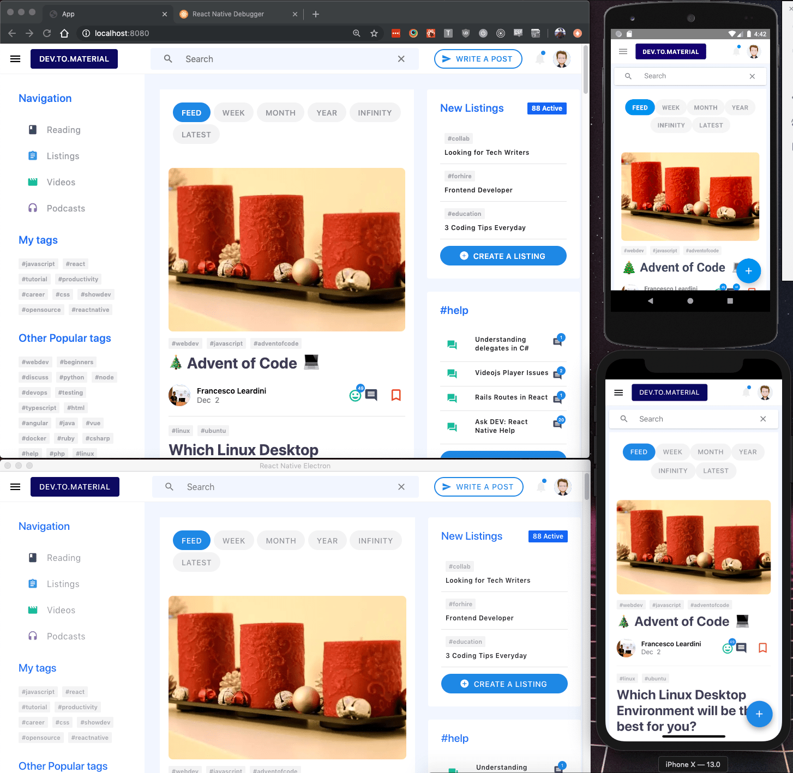

<h1 align="center" style="margin-top: 0px;">Dev.to Material</h1>

<p align="center" style="margin-bottom: 0px !important;">
  
</p>


<p align="center" >Material Dev.to client for 6 platforms with 100% code sharing</p>

# [Demo Site](https://cranky-kare-193fbd.netlify.com/)

## Intro

Dev.to.Material is a simple Material [Dev.to](https://dev.to/) client built with React Native that runs on the Web, Android, iOS, and Electron (Windows, Linux, and MacOS). This was built as an experiment in sharing 100% code between the above platforms. 

Check out [this article](https://www.consolelogs.dev/creating-material-devto-client-on-six-platforms/) to learn more]

### Features

Unfortunately, most [Dev.to API](https://docs.dev.to/api/) functionality is either in a closed Alpha or has not been documented yet. Currently implemented:

- Fetching Articles
- Searching Articles by Tags
- Clicking on Tags to filter Articles
- Clicking on Feed, Week, Month, etc
- Viewing an article

The rest of the client is static data.

###  Tech
The app is built using React Native `59.0` to render to each platform. [React Native Web](https://github.com/necolas/react-native-web) allows rendering React Native on the Web. The electron apps is rendered with React Native Web and [Electron](https://github.com/electron/electron) `4.0`. The following packages were also used:

- [Reac Routert](https://github.com/ReactTraining/react-router) , [React Router Native](https://github.com/ReactTraining/react-router/tree/master/packages/react-router-native), and [React Router Dom](https://github.com/ReactTraining/react-router/tree/master/packages/react-router-dom) (Router)
- [Material Bread](https://github.com/codypearce/material-bread) (UI Kit)
- [React Native Infinity](https://github.com/codypearce/react-native-infinity) (Project Setup)
- [react-responsive](https://www.npmjs.com/package/react-responsive) (Media Queries and Responsive)
- [react-native-render-html](https://github.com/archriss/react-native-render-html) (Rendering Article HTML)


## Quick Start

1. `git clone git@github.com:codypearce/devto-material.git`
2. `cd devto-material`
3. `npm i`
4. `npm run web`

## Web

All web config is found in `web` folder. 

```
npm run web
```

It should be running on port `8080`

## iOS
All config is found in `ios` folder.

1. Start an ios simulator
2. Open one terminal tab and run `npm start`
3. Open another terminal tab and run `npm run ios`

## Android

All config is found in `android` folder.

1. Start an android emulator
2. Open one terminal tab and run `npm start`
3. Open another terminal tab and run `npm run android`

## Electron

All electron config is found in `electron` folder. 


1. Open one terminal tab and run `npm run server`, this runs the electron webpack server.
2. Open another terminal tab and run `npm run electron`, this should open an electron window with the app running.

